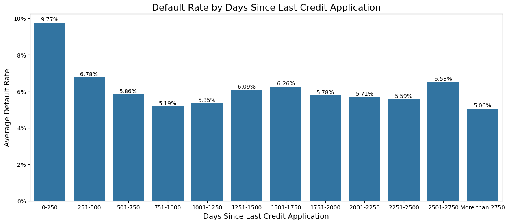

# Credit Default Risk

## Table of Contents

1. [Introduction](#introduction)
2. [Data](#data)
3. [Process Outline](#process-outline)
   1. [Initial Observation/Clean](#clean-data)
   2. [Analyze Data](#analyze-data)
   3. [Preprocess Data for Model](#preprocess-data-for-model)
   4. [Model Analysis/Prediction](#model-prediction/analysis)
4. [Next Steps](#next-steps)
5. [References](#references)

## 1 - Introduction 

Home Credit is a company that strives to give loans to the unbanked. The unbanked struggle to get loans because their credit histories are insufficient or non-existent.

They want to create a model that will help predict their clients' repayment ablities. They have a large variety of data on both traditional and non-traditional udnerwriting features.

Their goal is to find a model with at least a .70 Area Under the Receiver Operating Characteristic Curve **(ROC AUC)** score.

## 2 - Data 

They provided 9 different datasets that range between millions of rows and hundreds of columns.

The datasets are too large to commit to GitHub, but they can be found and downloaded from <a href="https://www.kaggle.com/competitions/home-credit-default-risk/data">here</a>

## 3 - Process Outline 

Process consisted of cleaning, analyzing, and preprocessing for model.

Due to the size of the datasets, each needed to be handled one-by-one and merged down in an appropriate way with the train sets.

The test set was provided as its own standalone sheet. Careful attention was paid regarding how data was preprocessed and merged with the test sets, to avoid leakage and to ensure train and test set features matched for the model.

### 3i - Initial Observations/Clean 

*[Click here](EDA_Default_Risk.ipynb) to jump to the notebook containing Exploratory Data Analysis*

Due to the large numbers of columns and rows, I intially chose to only choose columns that had zero nulls. I started with the application_train sheet as this included our target and SK_ID_CURR, which is the unique identifier. It is also the most current application.

I chose to next move to the credit bureau specific datasheets - bureau and bureau_balance. My prior experience as a loan officer has taught me that the most up-to-date and accurate information comes from the credit bureaus, rather than self-reported information on applcations.

After working through the bureau sheets, I moved to previous applications. Once this sheet was cleaned and preprocessed, I was able to get a ROC AUC above .70 without needing to use any of the other spreadsheets.

Once my minimum ROC AUC was achieved, I moved on to feature engineering and model tuning to see what results different models produced.

### 3ii - Analyze Data 

#### "Default Rate" of Target in train set - 8.07%

The number of loans that had a "1" in the target, which signifies payment issues or default, was approx. 8.07%. I am using the catch-all term "default rate" for this going forward. I believe it is important to note that these were not actual defaults or charge-offs of the loans. However, they were showing probelms with payments, which are the initial steps prior to a default.

According to the Mortgage Bankers Association, Q4 2024 mortgage default rates were as follows[^1]:

_* Conventional - 2.62%_

_* FHA - 11.03%_

_* VA - 4.07%_

It makes sense that the default rate would be higher than conventional loans. It is also a good sign that the default rate is lower than government subsidized loans like FHA.

#### Days Credit

The days credit feature of the bureau spreadsheet listed how many days before the most current application teh client applied for any other type of credit.

I wanted to dig into this a little more. My reasoning was that it is usually advised that one does NOT apply for other types of credit before taking out a large loan. This is partially because it can hurt your credit score and raise the interest rate on the larger loan.

Additionally, I have the assumption that even if you are able to qualify for the large loan, attempting to get other types of credit right before could end up putting someone in over their heads with payments. Someone who is applying for multuiple types of credit close together could very well be anticipating an upcoming cash crunch and is trying to borrow money in advance to get themselves out of the cash crunch. A cash crunh can very well lead to a loan default.

I first chose to bin the days credit column in 25 day increments:

### 3iii - Preprocess Data for Model 

### 3iv - Model Analysis/Prediction 

## 4 - Next Steps 

## References 

_Foreclosure Image_ - <a href="https://commons.wikimedia.org/wiki/File:Foreclosure_sign.jpeg">Casey Serin</a>, <a href="https://creativecommons.org/licenses/by/2.0">CC BY 2.0</a>, via Wikimedia Commons

[^1]: <a href="https://www.mba.org/news-and-research/newsroom/news/2025/02/06/mortgage-delinquencies-increase-in-the-fourth-quarter-of-2024">Mortgage Bankers Association</a>

DAys credit
Outline that bins above 250 are all less than the averag default rate so theyve been binend togtehr

